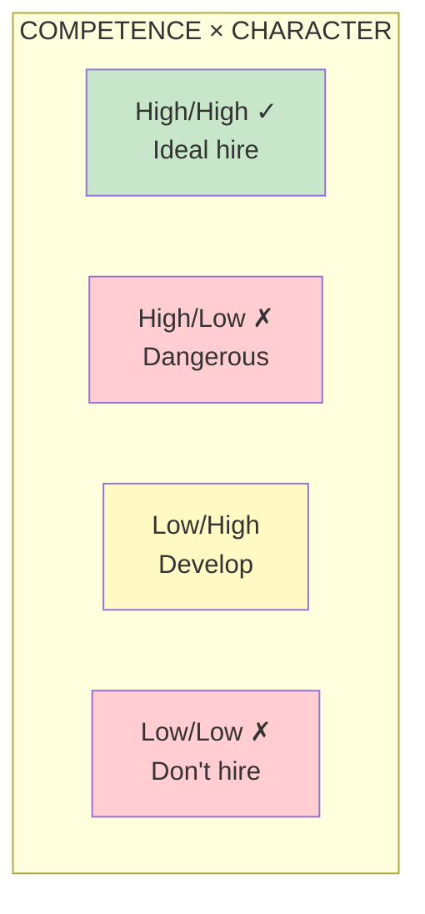
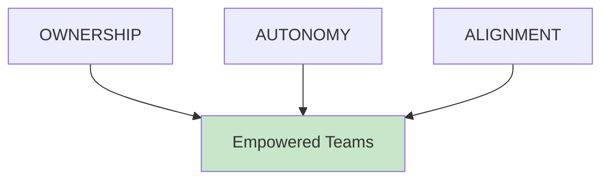

# Learning Path: Team Builder

**Level: Intermediate** | **Parts III-VII** | **36 Chapters**

This path covers how to build and structure teams for empowerment—staffing, topology, vision, strategy, and objectives.

## Path Overview

---

## Step 1: Staffing

**Goal:** Learn to hire and develop people with competence and character

### Read
- [Part III Overview](/chapters/part-03-staffing/overview/)
- [Chapter 26: Competence and Character](/chapters/part-03-staffing/ch26-competence-character/)

### Key Diagram

### Check Your Understanding
- [ ] Why is character as important as competence?
- [ ] How would you assess for character in an interview?

---

## Step 2: Product Vision

**Goal:** Learn to create and share a compelling product vision

### Read
- [Part IV Overview](/chapters/part-04-vision/overview/)
- [Chapter 37: Creating a Compelling Vision](/chapters/part-04-vision/ch37-compelling-vision/)

### Check Your Understanding
- [ ] What makes a vision compelling?
- [ ] How do you communicate vision effectively?

---

## Step 3: Team Topology

**Goal:** Learn to structure teams for ownership, autonomy, and alignment

### Read
- [Part V Overview](/chapters/part-05-topology/overview/)
- [Chapter 41: Optimizing for Empowerment](/chapters/part-05-topology/ch41-optimizing/)
- [Chapter 42: Team Types](/chapters/part-05-topology/ch42-team-types/)

### Key Diagram

### Check Your Understanding
- [ ] What's the difference between platform and experience teams?
- [ ] How do you balance autonomy with alignment?

---

## Step 4: Strategy & Objectives

**Goal:** Learn to develop strategy and assign objectives that empower teams

### Read
- [Part VI Overview](/chapters/part-06-strategy/overview/)
- [Part VII Overview](/chapters/part-07-objectives/overview/)
- [Chapter 53: Empowerment](/chapters/part-07-objectives/ch53-empowerment/)

### Check Your Understanding
- [ ] How do you assign problems rather than features?
- [ ] What makes an objective empowering?

---

## Path Complete!

You now understand:
- How to hire for competence and character
- How to create compelling product vision
- How to structure teams for empowerment
- How to develop strategy and assign objectives

**Continue with:** [Transformer Path](/paths/transformer/) to lead organizational transformation.
