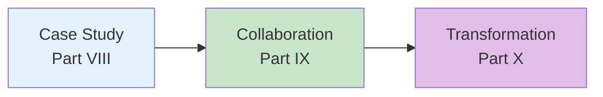
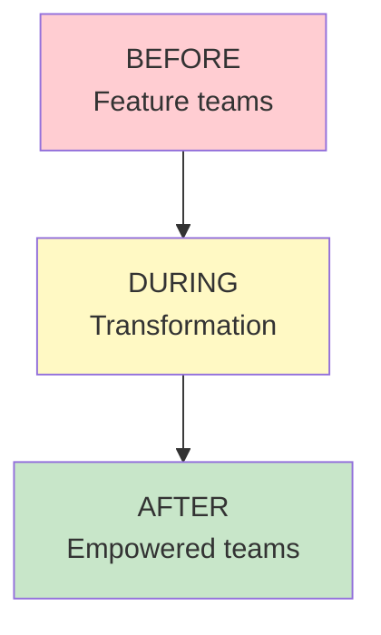
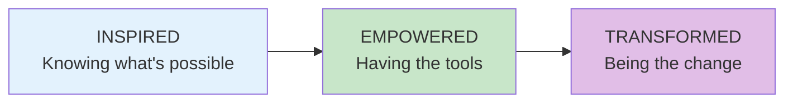

# Learning Path: Transformer

**Level: Advanced** | **Parts VIII-X** | **20 Chapters**

This path is for leaders ready to transform their organization from feature teams to truly empowered product teams.

## Path Overview

---

## Step 1: Case Study

**Goal:** See how all the concepts come together in a real transformation

### Read
- [Part VIII Overview](/chapters/part-08-casestudy/overview/)
- [Full Case Study](/chapters/part-08-casestudy/full-case/)

### Key Diagram

### Check Your Understanding
- [ ] What were the key steps in the transformation?
- [ ] What challenges did they face?

---

## Step 2: Business Collaboration

**Goal:** Learn to partner effectively with stakeholders

### Read
- [Part IX Overview](/chapters/part-09-collaboration/overview/)
- [Stakeholder Collaboration](/chapters/part-09-collaboration/stakeholder-evangelism/)

### Check Your Understanding
- [ ] What's the difference between stakeholder management and collaboration?
- [ ] How do you evangelize effectively?

---

## Step 3: The Transformation Journey

**Goal:** Understand the full journey from inspired to empowered to transformed

### Read
- [Part X Overview](/chapters/part-10-transformation/overview/)
- [The Journey](/chapters/part-10-transformation/journey/)

### Key Diagram

### Check Your Understanding
- [ ] What does it mean to be "transformed"?
- [ ] What is the most important thing for transformation?

---

## Path Complete!

You now understand:
- How transformation works in practice (case study)
- How to collaborate with stakeholders
- The complete journey from inspired to transformed
- The most important thing: developing people

**You've completed all three learning paths!**

The destination isn't a place you arrive at—it's a way of working. Continue learning, adapting, and helping your teams do extraordinary things.
